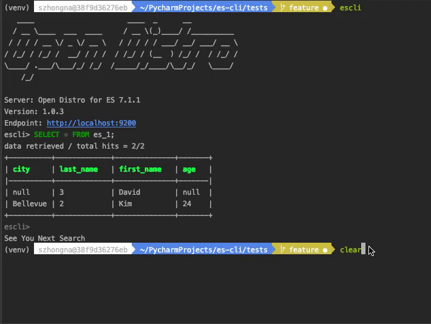

# Open Distro Elasticsearch SQL CLI

SQL CLI is a stand alone Python application and can be launched by a wake word `escli`. It serves as a support only for 
[Open Distro SQL plugin for Elasticsearch](https://opendistro.github.io/for-elasticsearch-docs/docs/sql/). You can move 
it around to other machines without having to install Elasticsearch on them.

## Installation
- `pip install escli` 
- escli is compatible with Python 3, and python 2 is going away soon https://pythonclock.org/ 

## Configuration
- A config file is automatically created at `~/.config/escli/config` at first launch. 
See the file itself for a description of all available options.

## Features
- Multiline input
- Auto-completion with index suggestion
- Formatted output
    - Tabular format
    - Fields name with color
    - Enable horizontal display (by default) and vertical display when output is too wide
    - Pagination for long output
- Syntax highlighting
- Connect to Elasticsearch node/cluster with authentication on either ES localhost, Open Distro ES, or AES,
- Load Config file
- Run single query from Command Line with parameters
    - *endpoint: * no need to specify a parameter, anything follow by wake word `escli` should be the endpoint. 
    By default, it’s http://localhost:9200
    - *--help:* help page for options and params
    - *-q:* follow by a single query user wants to run.
    - *-f:* support *jdbc/raw* format output
    - *-v:* display data vertically
    - *-u:* username to connect to Elasticsearch 
    - *-w:* password for username
    - *-e:* translate sql to DSL

- Run the CLI with parameters
    - *-p*: always use pager to display output
    - *--esclirc*: provide path of config file to load.

## Basic Usage

## Code of Conduct

This project has adopted an [Open Source Code of Conduct](https://opendistro.github.io/for-elasticsearch/codeofconduct.html).

## Security issue notifications

If you discover a potential security issue in this project we ask that you notify AWS/Amazon Security 
via our [vulnerability reporting page](http://aws.amazon.com/security/vulnerability-reporting/). 
Please do **not** create a public GitHub issue.

## Licensing

See the [LICENSE](./LICENSE.TXT) file for our project's licensing. We will ask you to confirm the licensing of your contribution.

## Copyright

Copyright 2019 Amazon.com, Inc. or its affiliates. All Rights Reserved.

## Development Guide
### Build the application in development
- `pip install virtualenv`
- `virtualenv venv` to create virtual environment for **Python 3**
- `source ./venv/bin/activate` activate virtual env.
- `cd` into project root folder.
- `pip install --editable .` will install all dependencies from `setup.py`.

### Run CLI
- Start an Elasticsearch instance from either local, Docker with Open Distro SQL plugin, or AWS Elasticsearch
- To launch the cli, use wake word `escli` followed by endpoint of your running ES instance. If not specifying 
any endpoint, it uses http://localhost:9200 by default. 

### Testing Procedure
- Prerequisites
    - Build the application
    - Start a local Elasticsearch instance with 
    [Open Distro SQL plugin for Elasticsearch](https://opendistro.github.io/for-elasticsearch-docs/docs/sql/) installed
    and listening at http://localhost:9200.
- `pip install -r requirements-dev.txt` Install test frameworks including Pytest and mock.
- `cd` into `tests` and run `pytest`

### Style
- Use [black](https://github.com/psf/black) to format code, with option of `--line-length 120`
